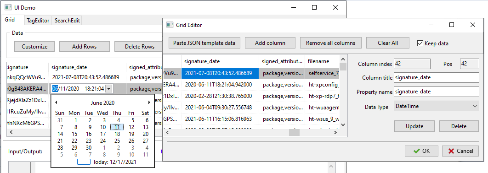
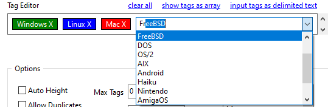
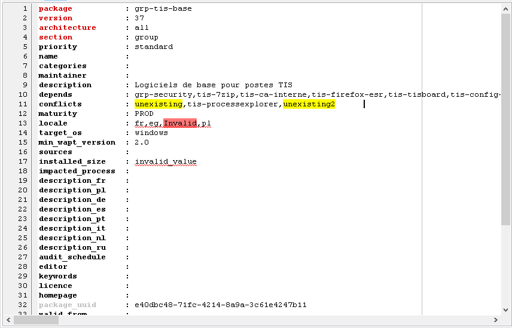
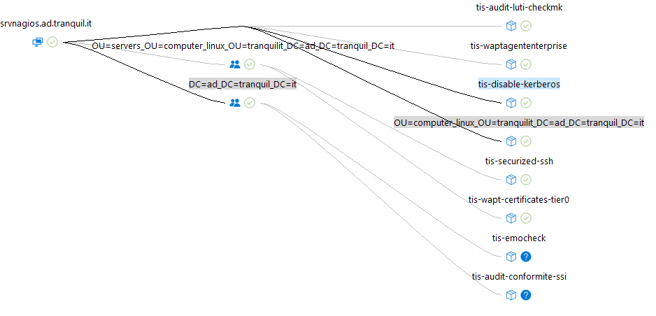
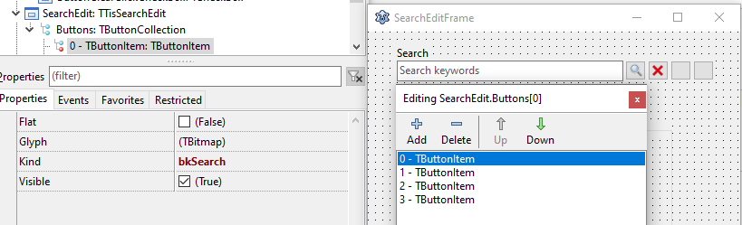

# Tranquil IT Components

All components created at Tranquil IT https://www.tranquil.it

Copyright (C) 2012 - 2022 — All Rights Reserved.

## Components

Most components are related to User Interface.

### TTisGrid Component

Based on TVirtualStringTree grid, this grid works with JSON and mORMot's TDocVariantData at the backend.

Main Features:

- JSON/TDocVariantData data backend
- design time component Editor to configure title, name, datatype, width, etc, either using sample JSON data from clipboard or Add/Remove column buttons
- autoconfigure itself, if a TDocVariantData is assigned to grid.Data property
- handle both expanded or compact JSON data from mORMot providers (array of arrays or array of json objects)
- user can hide/show columns in runtime
- user can save state/configuration
- Popup menu for Search, Copy line/cell, delete/select rows, export to CSV file
- user can customize Popup menu, either hide/show some itens or include new ones
- user can paste JSON directly on grid
- in-place editors, by defining a Data Type for each column using the Grid Editor 
- user don't need to use OnCreateEditor event to set a edit control, as it is automatically set by the grid, but he/she can use such event if they want to override the default edit control
- user can choose any Data Type for any column, but if the value could not be cast, there will not have error on editing (default values will be use)
- if user do not like those (default) controls, he/she can change it by implementing a inheritance from TTisGridControl and changing the TTisGridEditLink.ControlClasses for each data type they want to, which will change the edit control for all grids in the project
- use OnPrepareEditor event to customize any property of an edit control, before it shows up

### TTisTagEditor Component

Based on Andreas Rejbrand's work, this is our modified, improved, and Lazarus converted version.
You can also use TTisTagEditorRtti component, inherited from TTisTagEditor, which can be linked to other widgets or any object inherited from TPersistent.
It uses the same approach as components in RTTI Palette (RunTimeTypeInfoControls package dependency).

Main Features:

- tags can be created at runtime by typing, of course :)
- tags can be created by the Tags property
- custom colors can be defined for each tag
- for each tag a "hidden" Variant value can be added
- allows drag and drop tags
- each tag can have a "X" that allows you to delete the tag with 1 click
- a custom icon can be defined to replace the "X"
- custom events, such Before/After add/delete, for handling user actions
- input properties to define forbidden chars, max tags, allow duplicates, etc
- autocomplete option, with properties to define a list of items, style, search ascending/case sensitive, etc

### TTisControlSynEditor Component

Based on Lazarus TSynEdit component, this is a modified version specifically made for our WAPT Packages control files edition.
It mainly allows to add markups based on control keys.

Main Features:

- Error markups: Set all the line with red waves under the value (one per key)
- Info markups: Highlight a specific value with linked to a control key (multiple per key)
- Custom colors can be defined for each info
- Find starting position of given control key
- Find current control key linked to the cursor position

### TTisLvlGraphControl Component

Based on TLvlGraphControl component, this is a modified version made for our Wapt dependencies visualization.

Main Features:

- Possibility to zoom in/out
- Have the mouse right click used to select
- Have a specific PopupMenu on Nodes
- Allow to have selected/focused nodes
- Keep the focused node in the visible part of the graph
- Each Node can have two images instead of one
- Highlight in and/or out edges of selected nodes
- Drag the graph with the middle mouse button pressed

### TTisSearchEdit Component

Based on simple TComboBox component, this component can be used to do searching asynchronously for do not freeze the UI.

Main Features:

- AutoSearch property for enable/disable asynchronous search
- Buttons collection, which enables you to add any "helper buttons" you want
- Button Kind property, it has default implementations or bkCustom to do whatever you want
- SearchInterval property in milliseconds for delaying the search
- OnSearch event that has the logic for searching
- it keeps an automatically MRU history list for searched texts
- SearchMaxHistory property to setup how many items to keep on the MRU list
- can work with internal JSON, aka TDocVariantData, as same as TTisGrid
- like a TDBLookupComboBox, this component have LookupKeyField, LookupDisplayField, and KeyValue properties
- use Data property and LoadData method to work with JSON
- changing KeyValue will change ItemIndex, and vice-versa

### TTisToolBar Component

Based on simple TToolBar component, this component allow users redefine which buttons/actions they want to keep in tool bars among the system.

Main Features:

- the `Actions` property is a collection of `ActionList` instances, which should be defined (by developers) which actions users can work on the Editor in runtime
- the Editor shows all actions from `Actions`, separated by `Action.Category` in the left TreeView
- users cannot add new `ActionList` on the left side, but they can add/delete/reorganize buttons (that will fire the action selected on the left site) from these `Actions` on the right side
- use `SessionValues` property to storage user's configuration in runtime 
- the `Actions.Item[].HiddenCategories` will allow the developer do not show some categories (Action.Category), which is very useful for share a same ActionList among multiples ToolBar, but each one will work with just a few actions.
- you can setup how the Editor will show up using `EditorOptions` property

## Dependencies

First of all, you should have these libraries installed in your environment:
- [mORMot 2](https://github.com/synopse/mORMot2) — An Open Source Client-Server ORM/SOA framework in modern Object Pascal
- [pltis_utils](https://github.com/tranquilit/pltis_utils) — utilities 
- [virtualtreeview_package](https://gitlab.com/freepascal.org/lazarus/lazarus/-/tree/main/components/virtualtreeview)

On Lazarus it has been tested using these versions:

- FPC 3.2.0 win32/win64
- Lazarus 2.0.12 r64642

## Demo

You may want to take a look in the [demo project](./demo) to see each component working!

